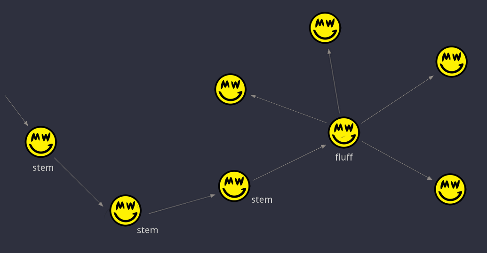

# Privacy

Privacy is instrumental to a peer-to-peer electronic cash system. In its essence, cash cannot distinguish between users, it does not reveal the amounts transferred or owned by individuals, and it holds no bias to the history of a specific coin or person.

Grin aims to preserve its user's privacy, while also keeping its core attributes of simplicity and scalability in mind. That said, by cleverly employing Mimblewimble along with several other methods, Grin is able to achieve a relatively high level of anonymity for its users. This document sets to explore how and to what extent.

First, there are no amounts. A Mimblewimble implementation natively uses Confidential Transaction, meaning all amounts are hidden; They are provably impossible to uncover, yet easily verified. Even before anything else, simply hiding amounts makes any analysis significantly more challenging.

Notably, there are no on-chain addresses either. Transactions hold minimal information, and each output is simply a commitment: a point on the curve. A transaction might look like this:

:   **Transaction**

    | Inputs      | Outputs                              |
    | ----------- | ------------------------------------ |
    | 08c482407fac2.....e335bf2f10d82      | 085cc6944467b.....a3f1d4274b79b |
    |                                      | 097b2588fd494.....494e43580476b |

!!! note ""
    Each transaction also carries rangeproofs and a kernel, but it's mostly irrelevant for this topic.

The above illustrates a normal transaction of 1 input and 2 outputs. The outputs (an input is also a reference to an output) are commitments, a 33 byte blurb to any observer. There's no address to tie an identity to, and it's not clear which output is the change and which belongs to the receiver.

In a Bitcoin-like system, there are multiple ways in which a user might (accidentally or intentionally) link an address to his identity. Consequently it is often trivial for analysis to link many of his addresses. Not only does his own privacy suffer, but also the entire network's privacy diminshes as a result.

A Grin commitment is one unique output. An address may be used to create an unlimited amount of outputs. An interesting analogy could be used to emphasize the difference:

* A commitment, once on-chain, is like a strictly-one-time-use address. Both of them only ever "contain" a single output.
* A commitment is *not* used to form transactions, unlike an address. A commitment is infact a *result* of a transaction after it was built peer-to-peer. This makes it significantly harder to link an identity to.

Furthermore, a key concept of Mimblewimble transactions is that several of them can be safely aggregated together, resulting in what looks like a single transaction. When done at the block level, every block essentially becomes one large transaction:

:   **Block**

    | Inputs      | Outputs                              |
    | ----------- | ------------------------------------ |
    | 08c482407fac2.....e335bf2f10d82    | 097b2588fd494.....494e43580476b  |
    | 0857b6b7eb6a2.....a0a283ed35974    | 09f731e071316.....42dae69672dca |
    | 085e205dea687.....8b8aeac7562c6    | 085cc6944467b.....a3f1d4274b79b |
    | 09035d331b17a.....bb76238f605fb    | 094262a95a67a.....2f246f6ce60ce |
    | 0961ee1db49ad.....602489c9c4517    | 09cf2db66b748.....7327297b8e69c |
    |                                    | 09c2751af8fe9.....fc745808238b6 |
    |                                    | 0900015eec3c1.....d52d78fca78de |

The outcome is a non-interactive CoinJoin with hidden amounts. It's called non-interactive since all transactions are aggregated into one without any coordination required between the different parties, as it's made possible at the protocol level.  

An observer knows how many transactions are included in the block, since each one carries a kernel, but nothing more. Any further information is impossible to obtain from looking at the chain.

!!! note ""
    Note that it's the default protocol behavior, not an opt-in feature which might taint outputs as being suspicous.

## Transaction Graph

## Dandelion

An important piece of information that commonly leaks is the *IP address* that originally sent the transaction. Normally, a transaction is just broadcasted to all connected peers and spreads quickly on the network, allowing for statistical analysis to deduce where it originated. In a peer-to-peer network, this might be hard as transactions are relayed, but over multiple transactions it becomes trivial.

To tackle this issue, Grin employs Dandelion (originally proposed as a BIP), a protocol designed to hide a transcation's origin IP address. Dandelion has two phases; a `stem` phase and a `fluff` phase. Once a transaction is initially broadcasted, it enters the `stem` phase, in which it it hops between individual peers. At a random point, the transcation enters its `fluff` phase and is spread (fluffed) among the entire network.

This makes it almost impossible to deduce a reliable IP address, and renders statistical analysis impractical.

{ width=675 }

Moreover, Dandelion provides an additional benefit unique to Mimblewimble, as it allows for transactions to be aggregated at a very early stage. If two or more transactions cross paths in their `stem` phase, they are aggregated into a single transaction prior to being fluffed, thus obscuring linkability of inputs and outputs that a sniffing node may have learned. However it remains to be seen how much actual privacy is gained from aggregation before fluffing, as it depends on having many other transactions.

??? note "INSPIRATION AND IDEAS"
    ---

    First of all, Grin does not have addresses. Unlike in most cryptocurrencies, in which coins are sent to a public key

    first of all, it's like one-time addresses
    second of all, transactions are formed peer to peer, so there's no reason to publish an address in public or in unsecure channels (or in Grin terms, anything connecting you to the transaction) unlike in bitcoin. even if a bitcoin user uses only one-time addresses, he might connect his identity to one of those addresses and then in the future tie several of his one-time addresses, thus linking his identity to several of his outputs while initially only linking his identity to one.

    ---
    ### Linking Inputs/Outputs

    Privacy by default. This enables complete fungibility without precluding the ability to selectively disclose information as needed.

    while the tx graph may be knows, as in you might be able to link different outputs, its still much harder to associate a certain identity with an output.

    Grin has many methods that may drastically improve privacy such as payjoin, coinswap etc and the beauty about them is that unlike bitcoin, your coins arent tainted for participating in what is pretty obviously a speicif mixing transaction. a payjoin/coinswap/aggregated tx looks exactly the same, nobody knows you extra privacy precautions to obfuscate the transaction graph

    dandelion is a first step to breaking the transaction graph linkability

        "tx are propagated through the network via Dandelion making it ~ impossible to tell where they originated while also preserving IP anonymity"

    Yes and even stronger, because there is aggregation along the stem, it will become harder for other parties to see which parts belonged to the same transaction. This aggregation is a special feature for MW, that is not possible with a Dandelion implementation for other currencies like Bitcoin.

    needs significant resources to track, much more so than bitcoin

    the privacy on-chain in perfect. the issue is on the peer to peer level, and they are addressable

    #### Grin for bitcoiners q&a:

    If I listen to transaction relay, can't I just figure out who they belong to before being cut-through?

    You can figure out which outputs are being spent by which transaction, but the trail of data stops here. All inputs and outputs look like random pieces of data, so you can't tell if the money was transferred, still belongs to the same person, which output is the actual transfer and which is the change, etc. Grin transactions are built with no identifiable piece of information.

    ---

    While Grin transaction outputs are fully obscured, it's still possible to trace which inputs links to which outputs at least until some age. But it's unclear at this point what information could be derived from this.

    My personal preference for MimbleWimble comes from its extreme simplicity (especially compared to zk-snarks) and great scalability. It's also less opaque than zcash, you can still reason about inputs and outputs while all identifiable information about them is obscured.

    Ownership is ensured through a single-use key.

    All transactions look like some random bits put together.

    As all transactions are confidential, there are no non-confidential transactions that can reveal information about the confidential ones. As transactions hold very little information, there is also very little opportunity for wallets or people to degrade privacy guarantees. Since everything looks like random bits, statistical analysis without additional information is impossible.

    ---
    #### joltz in privacy:

    In an ideal world we can provide technology that seamlessly offers privacy to humans. We can realize this world as we make technology that relies less on perfect human operation requiring high levels of knowledge and sophistication. We want privacy solutions accessible to all persons not just those that understand complex threat models who are able to pick and choose which tools to use for the right situation.

    Zooming in a little closer to cryptocurrencies, Bitcoin for an average user is not private. Amounts are public, a user may reuse addresses, a user probably uses a centralized wallet, users with private wallets probably do nothing to obscure their IP and the list goes on. However despite all of this people have been relying on a combination of Bitcoin, Tor and other privacy tools to protect their anonymity under the global adversarial threat model for years. How is this possible if Bitcoin is not private? Privacy is nuanced.

    ---

    in breaking mimblewimble privacy model, he could keep the logs of every transaction that passed by him, thus linking inputs and outputs. however, in dandelion, if two transactions cross paths, they'll be automatically aggregated (look like 1 transaction, just like a block) even before published on the chain. if they were aggregated in dandelion before he could see them, then he wasn't able to link. more usage = more aggragation prior to fluffing. also much harder to conenc tto real world identities becuase people dont publish their public keys (addresses) like in bitcoin. Grin tx data is not linkable to identities.

    keep in mind that while its trivial to single out transactions by many sniffing nodes, its impossible to figure out which output is the change output and which is the receiver's output, and that obfuscates the identities of the tx graph a lot

    ---

    #### lehnberg answering the blocks:

    Ivan also conveniently assumes here that Bitcoin addresses would never be reused, when we know that this is not a realistic assumption to make. It’s a feature of the protocol, and everybody from exchanges to invididuals use it today, trading off their collective on-chain privacy against convenience and usability.

    Grin prevents all this on the protocol level by not having on-chain addresses in the first place. You remove one area of possible user or service error altogether. And the entire network benefits from this as a result.

    We are constantly working on improving Grin’s privacy-preserving abilities. But we take a long-term view when we decide about adding features, being conscious of Grin’s two other, equally important design goals: Scalability and Minimalism

    Also note that this is only one aspect of Grin’s privacy preserving features, and there are many other areas where privacy improvements are coming at a faster pace. For instance, our upcoming 3.0.0 release will allow users to send and recieve payments via hidden services over the TOR network, which we believe will be a compelling privacy feature. You can graph as many transactions as you like, but you’ll still not find the recipient of a payment unless you’ve also compromised TOR, or if they compromise themselves in the ways described above.

    I agree with Ivan, Grin is more like Bitcoin than other privacy coins. It was launched fairly, it has no pre-mine, there is no dev tax, and it relies cryptographic assumptions that have been battle-tested.

    However, there are also a lot of important differences: Grin achieves better privacy with less data kept on chain and less data required to do a full sync, all with the same security. There is no trade-off here, you get more with less. (well, the less is interactive txs and no scripts)

    ---

    4) The transaction graph alone does not reveal information about the transacting parties…

    While it would be desirable to avoid leaking the transaction graph, the graph alone doesn’t necessarily reveal sender and receiver outputs. Without amounts, it’s difficult to distinguish between change outputs and recipient outputs. Even if the article doesn’t attempt to actually do this, it would be an interesting area for future research.

    ---

    #### phyro on keybase:

    Interesting finding, it's possible. Bogaty's article is very nice and informative, but is also wrong. He says the problem is inherent to MW and that it cant be fixed iirc. It's not a MW problem because MW paper never defined p2p aggregation layer. And there should be ways to fix it or improve it which I hope we do at some point. I'm still sad this one blew up the way it did

    ---

    Confidential Transactions

    Confidential Transactions (CT) was originally proposed by Greg Maxwell, former CTO of Blockstream and prolific cryptographer, to aid the privacy of Bitcoin transactions. It uses a Pedersen Commitment scheme which replaces plaintext unspent transaction outputs (UTXOs) values with cryptographic commitments. UTXOs represent individual piles of unspent money on the Bitcoin blockchain, an alternative approach to account balances. A cryptographic commitment binds the user to a chosen value without revealing what that value is. This means if and when the time comes for the user to reveal the chosen value, they cannot change their mind about the value as only the original value will satisfy the mathematics involved.

    This approach is called a commitment scheme, and has two phases; commit and reveal. The really cool part is that only recipients of a confidential transaction need to learn what the value actually is. Pedersen commitments follow the additive homomorphic property and therefore allow us to check that the sum of the inputs equals the sum of the outputs within a transaction. Transactions can be validated without knowing the amount transacted — a big win for privacy.

    MimbleWimble uses the Confidential Transactions scheme for bookkeeping on its blockchain. There are no observable values on MimbleWimble, only cryptographic commitments and range proofs. The homomorphic additive property ensures that the total money supply in the system can be continuously checked without having amounts be visible.
    CoinJoin

    CoinJoin is another technique invented by Greg Maxwell. CoinJoin allows users to combine their transactions together so that the transaction graph becomes a bit more obfuscated. The transaction graph reveals who is a party to a transaction and can reveal information about relationships between different users and the history of a coin. It is sometimes assumed that if multiple inputs are spent, they must belong to the same user’s wallet. If enough people use CoinJoin, this breaks the assumption that multiple inputs to a transaction are from the same user, which is a boon for privacy. CoinJoin is a nice technique, but it has the significant drawback of requiring cooperation or interaction amongst the participants since every input owner must sign the entire combined transaction to authenticate it. It’s not possible for transactions to be combined in an offline or asynchronous manner.

    There has been significant research on allowing a non-interactive CoinJoin. One technique implements a scheme called One Way Aggregate Signatures (OWAS) and has promise, but involves more complex cryptographic assumptions, specifically pairing cryptography. Ethereum founder Vitalik Buterin has written an explainer on pairing cryptography — the main idea is that it introduces operations that require a one-to-one mapping between points on two elliptic curves. Greg Maxwell discusses the non-interactive CoinJoin proposal in this bitcointalk thread in 2016.

    MimbleWimble avoids the need for more complicated security assumptions, and instead relies only on the same elliptic curve cryptography assumptions already utilized within Bitcoin. It also allows for non-interactive combination of transactions. This is one of the main reasons to get excited about MimbleWimble. In fact, **the protocol combines all transactions at the block level automatically.** Transaction structure is removed within each block, and the blocks are validated as a whole, as if they are a single transaction (and that's how they look like on the chain).

    Interestingly, the system does away with addresses, and instead outputs are actually commitments that can only be spent by people with knowledge of a particular parameter used to create the commitment. This parameter is known as a blinding factor and was originally included in Confidential Transactions purely for privacy. In a clever modification, MimbleWimble uses the blinding factor as the private key that authorizes the spending of an output. These blinding factors are now fundamental to authentication, and must not be shared.

    Transaction cut-through is a boon to privacy as well, but only helps privacy when the transactions occur within the same block.

    The consolidation of transactions within a block helps privacy as well, especially against casual onlookers. However if a spy node receives transactions individually, they can begin to compile a forensics database that associates inputs with outputs, possibly linking them to IP addresses. This information could later be used to possibly deanonymize parts of the chain later with learned information.

    Both implementations of MimbleWimble utilize a proposal called Dandelion a network routing proposal originally created for Bitcoin that creates plausible deniability. It passes transactions around via several hops and, in MimbleWimble, later aggregates them randomly before they are sent to miners for inclusion into a block. This will make it much harder for spy nodes to learn about what’s happening.

    ## Cryptographic Primitives

    Confidence in certain cryptography is gained by having it last a long time without being broken. Mimblewimble only relies on elliptic curves; simple and very well vetted cryptographic constructs and assumptions.
