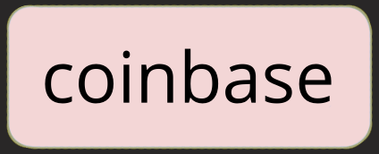
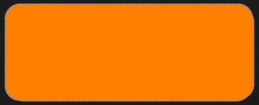
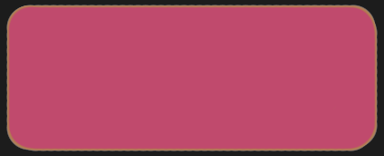
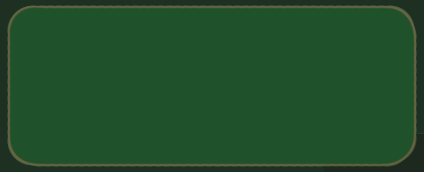
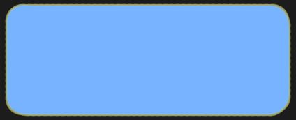

# Scalability

A Mimblewimble chain is massively-prunable, which allows it to stay lightweight and cheap to verify. Its core essence is this unique balance of privacy and scalability.

Once an output is spent, there's no longer any need to keep it and it's removed from the chain. A 100 bytes kernel is left for each transaction, forever proving it's validity. The result is, that in order to verify the entire history starting from the genesis block, only the kernels and the set of unspent outputs are needed. Let's illustrate a trail of transactions:

*(switch between tabs)*

=== "Before"

    | Inputs     | Outputs      |            |
    | :--------: | :----------: | :--------: |
    |            | t r a n s a c t i o n |   |
    | { width=40 }   | { width=40 }            | Kernel     |
    |            | t r a n s a c t i o n |   |
    | { width=40 }          | { width=40 }            | Kernel     |
    |            | { width=40 }            |            |
    |            | t r a n s a c t i o n |   |
    | { width=40 }          | { width=40 }            | Kernel     |
    | { width=40 }   | { width=40 }            |            |
    |            | { width=40 }            |            |
    |            | t r a n s a c t i o n |   |
    | { width=40 }          | { width=40 }            | Kernel     |
    | { width=40 }          | { width=40 }            |            |

=== "Cut-through"

    | Inputs     | Outputs      |            |
    | :--------: | :----------: | :--------: |
    |            | t r a n s a c t i o n |   |
    | { width=40 }   | &#x2731; { width=40 }  &#x2731;          | Kernel     |
    |            | t r a n s a c t i o n |   |
    | &#x2731; { width=40 } &#x2731;         | &#x2731; { width=40 } &#x2731;           | Kernel     |
    |            | { width=40 }            |            |
    |            | t r a n s a c t i o n |   |
    | &#x2731; { width=40 } &#x2731;         | &#x2731; { width=40 } &#x2731;           | Kernel     |
    | { width=40 }   | &#x2731; { width=40 } &#x2731;           |            |
    |            | { width=40 }            |            |
    |            | t r a n s a c t i o n |   |
    | &#x2731; { width=40 } &#x2731;         | { width=40 }            | Kernel     |
    | &#x2731; { width=40 } &#x2731;         | { width=40 }            |            |

=== "After"

    | Inputs     | Outputs      |            |
    | :--------: | :----------: | :--------: |
    |            | t r a n s a c t i o n |   |
    | { width=40 }   |             | Kernel     |
    |            | t r a n s a c t i o n |   |
    |            |              | Kernel     |
    |            | { width=40 }            |            |
    |            | t r a n s a c t i o n |   |
    |            |             | Kernel     |
    | { width=40 }   |              |            |
    |            | { width=40 }            |            |
    |            | t r a n s a c t i o n |   |
    |            | { width=40 }            | Kernel     |
    |            | { width=40 }            |            |

An output is considered 'spent' once it is used as an input. As demonstrated above, every single input can disappear as well as every spent output, leaving only a small kernel behind. What remains is only the set of unspent outputs and the set of kernels proving its validity.

A full verifier needs the following data:

* The chain of headers
* List of unspent outputs
* Kernels

!!! info ""
    An output is a 33 bytes commitment accompanied by a 640 byte rangeproof.

Following this logic, the chain mostly grows by the number of users, instead of the number of overall transactions. In fact, it often *shrinks in size* when more inputs are used than new outputs are created.

Building, verifying and storing transactions requires minimal resources. Anyone can fully verify the chain on a phone or on cheap hardware, and run a node in areas with poor network connectivity.

## Comparison For Bitcoiners

At the time of this writing, there were 560M Bitcoin transactions, taking up 300GB of space. Somebody who wants to verify the current state must replay each and every transaction. He will check millions of outputs to eventually derive the current set of 66M unspent outputs.

Mimblewimble shrinks the transaction history such that a chain with Bitcoin's history would be kept at around 1/4 of its size. This difference becomes much more exciting if one remembers that Mimblewimble employs Confidential Transactions, so that each output requires a large rangeproof. If the current Bitcoin blockchain had hidden amounts, it's size would have been on the order of several terabyes.
