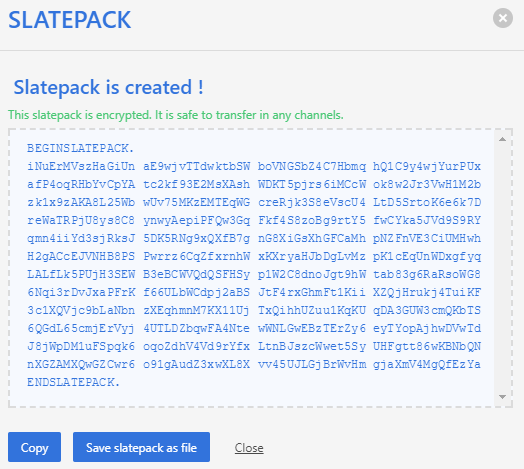
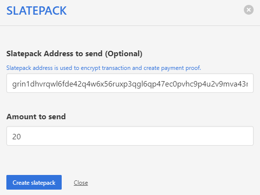

# Grin Wallets

[{ align=left width=60 }](https://grinplusplus.github.io/){:target="_blank"}

## &emsp;Grin++

 
GUI wallet and node written in C++ &emsp;~Windows,~ ~Linux,~ ~macOS~

??? abstract "How to: send/receive"
    === "Download"

        Download at [grinplusplus.github.io](https://grinplusplus.github.io/){:target="_blank"}

        [Troubleshooting](https://davidtavarez.github.io/2020/troubleshooting-grinplusplus/)

    === "Receive"

        * Copy your address (`grin1...`) and provide it to the other party.

        { width=400 loading="lazy" }

        That's it. If both your wallets can communicate via Tor, the transaction is then completed automatically.

        *But if there's no Tor communication, next steps are:*

        * The sender will provide you a Slatepack message. Paste it into the Slatepack box and click Receive.

        { width=400 loading="lazy" }

        * Copy the Slatepack message your wallet generates.

        { width=400 loading="lazy" }

        * Provide it to the sender.

        Done! The sender will finalize the transaction and post it to the chain.

    === "Send"

        * Click send.

        { width=400 loading="lazy" }

        * Choose the amount of grins.

        { width=400 loading="lazy" }

        * Enter the receiver's address and send.

        { width=400 loading="lazy" }

        That's it. If both your wallets can communicate via Tor, the transaction is then completed automatically.

        *But if there's no Tor communication, next steps are:*

        * Copy the Slatepack message your wallet generates and provide it to the receiver (however you want).

        { width=400 loading="lazy" }

        * You should get a Slatepack message back from the receiver. Paste it into the Slatepack box and click Finalize.

        { width=400 loading="lazy" }

        Done! Your wallet will then finalize the transaction and post it to the chain.

---

[{ align=left width=60 }](https://github.com/grinfans/Niffler){:target="_blank"}

## &emsp;Niffler

 
GUI wallet and node using the main implementation as back-end &emsp;~Windows,~ ~Linux,~ ~macOS~

??? abstract "How to: send/receive"
    === "Download"

        Download at [github.com/grinfans/niffler/releases](https://github.com/grinfans/niffler/releases){:target="_blank"}

        (by clicking on one of the listed download links)

    === "Receive"

        * Click on Receive, then on Slatepack address.

        { width=400 loading="lazy" }

        * Copy your address (`grin1...`) and provide it to the other party.

        That's it. If both your wallets can communicate via Tor, the transaction is then completed automatically.

        *But if there's no Tor communication, next steps are:*

        * The sender will provide you a Slatepack message. Click again on Receive, then on Create response slatepack. Paste it into the Slatepack box and click Create response slatepack.

        { width=400 loading="lazy" }

        * Copy the new Slatepack message your wallet generates.

        { width=400 loading="lazy" }

        * Provide it to the sender.

        Done! The sender will then finalize the transaction and post it to the chain.

    === "Send"

        * Click on Send, then on Create slatepack.

        { width=400 loading="lazy" }

        *

        { width=400 loading="lazy" }

        { width=400 loading="lazy" }

---

[{ align=left width=55 }](https://ironbelly.app){:target="_blank"}

## &emsp;Ironbelly

 
Mobile wallet &emsp;~iOS,~ ~Android~

??? abstract "How to: send/receive"
    === "Download"

        Download at [https://ironbelly.app](https://ironbelly.app/){:target="_blank"}

    === "Receive"

        Soon

    === "Send"

        Soon

---

 

# Related Services

[{ align=left width=90 }](https://grinnode.live/){:target="_blank"}

## &emsp;Grinnode.live

 
Public GRIN API and sync service

---
