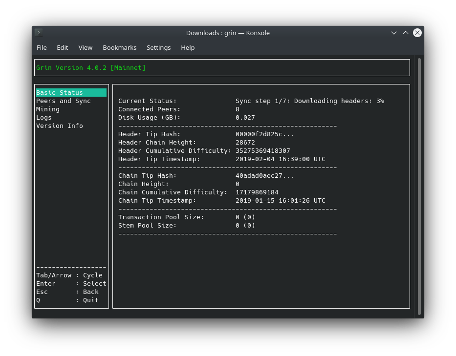
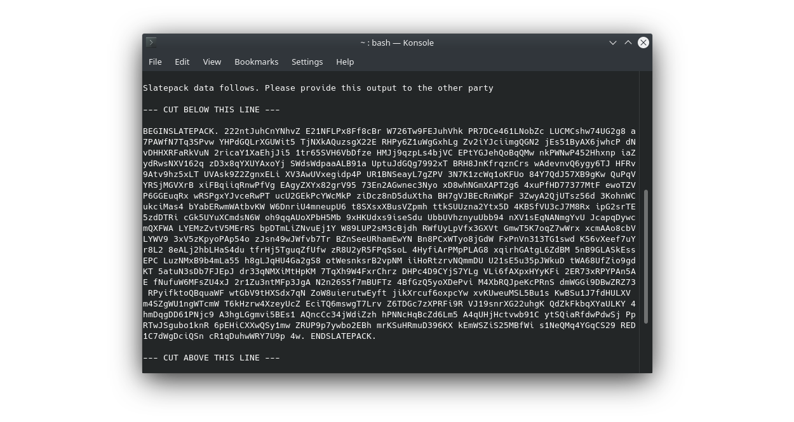

# Quickstart

In this tutorial you will learn how to:

- Install Grin node and wallet
- Run a full node
- Create a wallet
- Send & receive grin

!!! tip ""
    If you want to use Grin with a graphical user interface, please refer to [community projects](community-projects.md).

## Requirements

Grin and Grin-Wallet software are compatible with Linux, macOS and Windows.

It has been tested specifically on:

- Ubuntu 18.04 (on earlier versions you'll need to compile)
- macOS 10.15 Catalina
- Windows 10

## Install Grin and Grin-Wallet

'Grin' is the node software and 'Grin-Wallet' is the command-line wallet.

!!! tip ""
    The following section will guide you to install using precompiled binaries.
    If you wish to build Grin and Grin-Wallet yourself, refer to the [building section](TODO).

### Linux

#### Snap Store

If you have Snap installed simply type:

```bash
snap install grin
```

Note that when installed with Snap, Grin-Wallet is accessible using the `grin.wallet` command instead of `grin-wallet`.

#### Manually

On [Grin website](https://grin.mw/download), download Grin and Grin-Wallet.

Navigate to the directory where the files were downloaded and type (replace `$VERSION`):

```bash
sudo tar -C /usr/local/bin -xzf grin-$VERSION-linux-amd64.tar.gz --strip-components=1
sudo tar -C /usr/local/bin -xzf grin-wallet-$VERSION-linux-amd64.tar.gz --strip-components=1
```

??? warning "libncursesw error &#8628;"
    If you have the following error when you start Grin:

    ```bash
    grin: error while loading shared libraries: libncursesw.so.5: cannot open shared object file: No such file or directory
    ```

    Then install `libncursesw5`:

    ```bash
    sudo apt install libncursesw5
    ```

### macOS

The easiest way to install Grin and Grin-Wallet on macOS is with [homebrew](https://brew.sh).

If you do not have homebrew installed, open the "Terminal.app" and paste the following line:

```bash
/bin/bash -c "$(curl -fsSL https://raw.githubusercontent.com/Homebrew/install/master/install.sh)"
```

This will install homebrew on your computer. Once it's finished you can install Grin and Grin-Wallet:

```bash
brew install grin grin-wallet
```

### Windows

On Windows, the simplest way to install is by downloading the binaries on the [Grin website](https://grin.mw/download).

We recommed that you create a directory called `grin` in `C:\Users\%USER%`. In this directory, extract both binaries `grin.exe` and `grin-wallet.exe`.

---
## Running a Grin Node

The rest of the documentation is common for Linux, macOS and Windows.

!!! note ""
    On Windows, you will need to replace the `grin` and `grin-wallet` commands with `grin.exe` and `grin-wallet.exe`.

Running a Grin node is as simple as typing the command:
```bash
grin
```

You should see the following window:

Congratulations! 🎉 You are now running a Grin full node.
The initial sync might take from 30 minutes to a few hours depending on your connection speed and CPU performance.

!!! note ""
    If you can, consider opening port 3415 to allow inbound peer connections. It will help other nodes with their own initial sync.


## Creating a Grin Wallet

While your node is syncing, let's initalize a new Grin wallet.

In the command prompt type the following:

```bash
grin-wallet init
```

Your wallet will now ask for a password (optional). Most wallet commands will require you to enter your password, so you'll be typing it quite often.
In order to hide it, your keyboard input will not be displayed.

```text
Please enter a password for your new wallet
Password:
Confirm Password:
```

Next, the wallet will show your recovery-phrase:

```text
Your recovery phrase is:

undo execute festival romance just void custom leopard balcony trick waste castle fire master lecture ordinary million slam wise oil whisper mechanic episode room
```
This phrase is a list of 24 words which encode all the information needed to recover your wallet. If your computer breaks or your hard drive becomes corrupted, you can enter `grin-wallet init -r` and type the phrase to recover your grins.

Store it safely, preferably in a non-digital format.

## Receiving Grins

Let's see how you can receive your first grins.

!!! note "Interactive Transactions"
    The nature of [Mimblewimble](../technical/introduction-to-mimblewimble) protocol means that the sender & receiver need to interact with one another, in some way or another, in order to form [transactions](TODO).

The first step is to generate an address:

```bash
grin-wallet address
```

Your address will look like this:
```text
grin1dhvv9mvarqwl6fderuxp3qgl6qppvhc9p4u24347ec0mvgg6342q4w6x56
```

Give it to the sender.

To understand what comes next, you should know there are two primary ways to interact with the other party: [Tor](TODO) and [SlatepackMessage](TODO.LINK-TO-TRANSACTION-PAGE-SLATEPACK-TITLE). Tor is the default, and SlatepackMessage is the alternative method used if the former didn't succeed.

#### Tor

All you need to do is type:
```bash
grin-wallet listen
```
Done! This sets up your wallet to listen for incoming connections through Tor. You can type `grin-wallet info` to check your wallet balance.

However, If the connection wasn't successful (maybe one of you doesn't even have Tor installed), Grin-Wallet will automatically show the sender an encoded text message called a `Slatepack`, which he can send you in whatever channel you agree upon, such as an encypted chat, email, social-network, or a pigeon.

#### Slatepack
The message you receive should look like this:
```text
BEGINSLATEPACK. HctgNGXrJDGFY3B KrEF1meAezGjxQ6 Z93QF6Ps2m9yKCQ LfhZvpDY9ZXViM7 nDoNeMvwtYV2crr 8gDqvYDmtRfLL3n Uabao7VyWR4AuYg TXQUSWU83kEhKmr bRtdRjvpisx1LYo 9cyZGfsgsd7ZvDJ KKZPHhcPe4Eivtv cMvee3nwFFY3ZnM SoULNaHVJ38h3tZ vMXQMoMLB17L53o Xy6QQjDaG8avUBt LQq2GfGRTiUPQgn vQwFzfZPVzVKNLk 5AFmUQFZtiVdTJV xHvc1BuAqcamerv Y76KVccPY3WGupy 4zWFpkjTH65XNiH XqQnkb3EA1iVrHc tyTJ1PWb6X6oV1k ktYiWBpatyTirRy CywPyjr6c8XLr4Q 9VoCedU5BcdFdMB ACqQTwjgVXqjHoS 58ZPKFitjeH67Ts ah6twcKtMaFmTXD i7JEQ7qV6cewgxH 2jwWFxbb98mye6A Lm9movc6Wer26L2 91WQD3cbVpAZLEs APFPtyxnWjv8n3W ZXFLR2TPZwGc5Vt zwFUPoyWfKXasQy VVV6tbKWEEhqAZR e34M7uEwfurpUUi 9812VFPY1qw3K9b ynwQXuXMuWQCUnU s1JqWqFgSQKENUP tGCK19dys9twghA FaAc7ZXQHdMbUoL sVxVfdjE94F1Wpj M7QAM5VZuaauHdQ Mt2erFyxJ5vsYSZ hgS553UKoQL5YWX E7oRNdMDkJV6VkL i55kAQc1vWvW9ce 3MoXiBT4TJ1SyNS NVZKxgk8c. ENDSLATEPACK.
```
Your next step would be to type:
```bash
grin-wallet receive
```
Then enter the message you were sent into the prompt.

Next, your wallet will output a beautiful `Slatepack` of its own:

{ width=650 }

Copy and send it to the other party, and that's it, you've completed your role!

It's now in the hands of the sender to finalize and post the transaction to the network. You can tell when it's accepted by the chain by typing `grin-wallet info` and seeing if there's an amount waiting for confirmation.


## Sending Grins

To send grins, use the `send` command, and specify both the destination address (`-d`) and amount.

```bash
grin-wallet send -d [address] [amount]
```

Example of sending 30 grins:

```bash
grin-wallet send -d grin1dhvv9mvarqwl6fderuxp3qgl6qppvhc9p4u24347ec0mvgg6342q4w6x56 30
```

!!! note "Locked Outputs"
    From now on and until confirmed in the chain, the outputs used in this transcation are [locked](TODO.LOCKED-OUTPUTS-TITLE).

The wallets will interact through Tor and complete the process automatically.

However, If the connection wasn't successful, your wallet will show a `Slatepack` message which you need to provide the receiver with. The receiver then uses the `receive` command to process it (as demonstrated earlier), and returns back to you a `Slatepack` he produced himself.

Simply type the following command:

```bash
grin-wallet finalize
```
And enter into the prompt the last `Slatepack` message you were sent.

Your wallet will complete the transaction building process and post it to the network, along with a fee, to be included in an upcoming block. Celebrate this milestone with an unapologizing smile ツ
