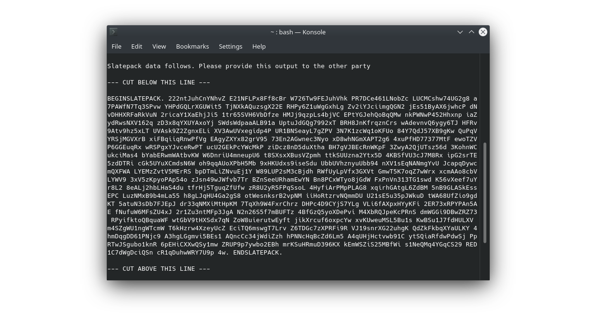

# Receiving Grins

Let's see how you can receive your first grins.

!!! note "Interactive Transactions"
    The nature of [Mimblewimble](../technical/introduction-to-mimblewimble) protocol means that the sender & receiver need to interact with one another, in some way or another, in order to form [transactions](TODO).

The first step is to generate an address:

```bash
grin-wallet address
```

Your address will look like this:
```text
grin1dhvv9mvarqwl6fderuxp3qgl6qppvhc9p4u24347ec0mvgg6342q4w6x56
```

Give it to the sender.

To understand what comes next, you should know there are two primary ways to interact with the other party: [Tor](TODO) and [Slatepack](TODO.LINK-TO-TRANSACTION-PAGE-SLATEPACK-TITLE). A Tor connection is attempted first, but if it isn't accessible (counterparty offline, or either party doesn't have Tor service installed), then `Slatepack` method is automatically chosen.

### Tor

All you need to do is type:
```bash
grin-wallet listen
```
Done! This sets up your wallet to listen for incoming connections through Tor. You can type `grin-wallet info` to check your wallet balance.

### Slatepack
`Slatepacks` are encoded text messages used to transfer the data required to form a transaction, used as an alternative to a hands-off synchronous method such as Tor.

The text you receive from the sender should look like this:
```text
BEGINSLATEPACK. HctgNGXrJDGFY3B KrEF1meAezGjxQ6 Z93QF6Ps2m9yKCQ LfhZvpDY9ZXViM7 nDoNeMvwtYV2crr 8gDqvYDmtRfLL3n Uabao7VyWR4AuYg TXQUSWU83kEhKmr bRtdRjvpisx1LYo 9cyZGfsgsd7ZvDJ KKZPHhcPe4Eivtv cMvee3nwFFY3ZnM SoULNaHVJ38h3tZ vMXQMoMLB17L53o Xy6QQjDaG8avUBt LQq2GfGRTiUPQgn vQwFzfZPVzVKNLk 5AFmUQFZtiVdTJV xHvc1BuAqcamerv Y76KVccPY3WGupy 4zWFpkjTH65XNiH XqQnkb3EA1iVrHc tyTJ1PWb6X6oV1k ktYiWBpatyTirRy CywPyjr6c8XLr4Q 9VoCedU5BcdFdMB ACqQTwjgVXqjHoS 58ZPKFitjeH67Ts ah6twcKtMaFmTXD i7JEQ7qV6cewgxH 2jwWFxbb98mye6A Lm9movc6Wer26L2 91WQD3cbVpAZLEs APFPtyxnWjv8n3W ZXFLR2TPZwGc5Vt zwFUPoyWfKXasQy VVV6tbKWEEhqAZR e34M7uEwfurpUUi 9812VFPY1qw3K9b ynwQXuXMuWQCUnU s1JqWqFgSQKENUP tGCK19dys9twghA FaAc7ZXQHdMbUoL sVxVfdjE94F1Wpj M7QAM5VZuaauHdQ Mt2erFyxJ5vsYSZ hgS553UKoQL5YWX E7oRNdMDkJV6VkL i55kAQc1vWvW9ce 3MoXiBT4TJ1SyNS NVZKxgk8c. ENDSLATEPACK.
```
Your next step would be to type:
```bash
grin-wallet receive
```
Then enter the message you were sent into the prompt.

Next, your own wallet will output a beautiful `Slatepack` as well:

{ width=650 }

Copy and send it to the other party, and that's it, you've completed your role!

It's now in the hands of the sender to finalize and post the transaction to the network. You can tell when it's accepted by the chain by typing `grin-wallet info` and seeing if there's an amount waiting for confirmation.
